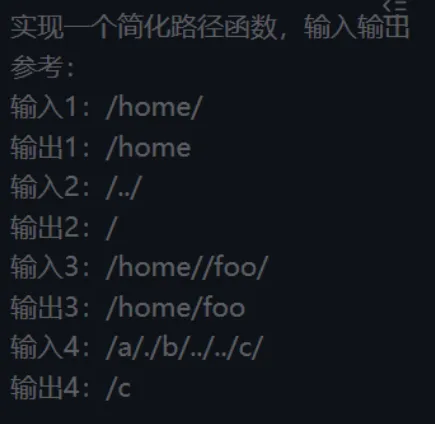

## 米哈游一面
### 实习/项目
在实习或者项目中亮眼的一点  
随便在实习经历又挑了一点让展开  
### 计算机基础
线程进程和协程  
协程在 js 底层的使用  
tcp 和 udp 不同  
http 各个版本使用的是 tcp 还是 udp  
### css js
css 的 gpu 加速机制  
js基本数据类型和引用数据类型不同&垃圾回收上的不同
js事件循环  
先执行宏任务还是微任务  
### 框架
vue 的响应式原理  
react 和 vue 的 key 用途  
vue 如果没有设置 key 会有什么问题  
### 算法  

### 反问  

1. 面试官玩原神吗  
   a. 不咋玩原神，但很多同事玩，还玩星铁
2. 面试官觉得米哈游哪些游戏比较好玩  
   a. 不怎么玩游戏
3. 米哈游前端方面业务是咋样的  
   a. 我们做的是提效工具，tob，有给地图侧去做一些优化等等
