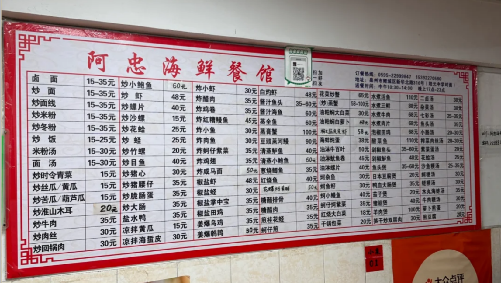

## 泉州

### 玩

西街
开元寺
钟楼中山路
承天寺
关岳庙

### 吃

#### 饮品甜品

唐沫茶兮 开心，青盐，木梨馥
时下有茶 开心芭乐
米斯小庄庄（芋头刨冰）
奶香铺子（双皮奶底的好吃
阿达子奶茶（西街）
壶见 铁观音奶茶 珍珠换成石花膏

#### 美食

洪濑鸡爪
闽兴庄阿姨芋头饼/勤阿姨芋头饼
春哥铁板烧
涂门街泮宫蚵仔煎
水门国仔和远记面线糊
a 文面线糊

#### 海鲜

阿忠海鲜餐馆 椒盐蛏子和油淋鱿鱼

朱富贵海鲜火锅

#### 外卖

一品生蚝
王阿姨摇桃（中山路）（酸嘢）
阿秋牛排
庄记沙茶面

皇叔四果汤

## 平潭

行程
13：37-15：28 D6564
仙人井
北湾文创村
坛南湾
镜沙（5-6 点退潮再去

### 吃

#### 饮品

萨吾缇（咸法酪

#### 美食

欧巴台湾蚝蛋烧（平潭车站夜市
牛排意面（平潭车站夜市
丁公子衢州鸭头
好味亭炸串
916 臭豆腐
韩式煎包/谭记煎包（有人吃早餐么
云记烤鸭

#### 海鲜

岚岛风味小吃
毛记海鲜砂锅粥
渔村小灶·海鲜排挡 海蛎抱饭

#### 外卖

小明新疆炒米粉
第一香麻辣烫
